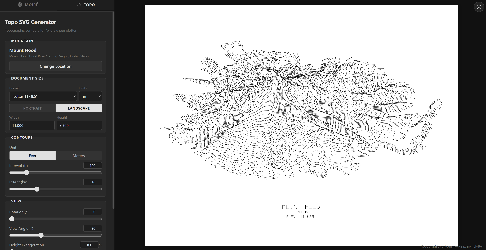

# SVG Generator for AxiDraw

A browser-based tool for generating plotter-ready SVG files for the [AxiDraw](https://www.axidraw.com/) pen plotter. Search for real-world locations to create topographic contour maps, or layer geometric patterns to produce moiré interference art — all exportable as print-ready SVGs with physical dimensions.

<!-- Add a screenshot: save it to screenshots/preview.png, then uncomment the line below -->


**[Live Demo](https://svg-plotter.spencer-russell.com)**

## Generation Modes

### Topo

Generates topographic contour maps from real-world elevation data. Search any location by name, and the app fetches terrain tiles, builds an elevation grid, and renders contour lines at configurable intervals. Supports rotation, oblique perspective, height exaggeration, and stroke-font labels.

### Moiré

Creates interference patterns by overlaying two layers of geometric shapes (concentric circles, radial lines, spirals, waves, grids). Each layer has independent controls for density, offset, rotation, and scale. Paths are automatically reordered using nearest-neighbor optimization to minimize pen-up travel time.

## Features

- Real-time preview with live parameter adjustment
- SVG export with physical dimensions (mm/cm/in) for direct plotter use
- Document size presets (Letter, Tabloid, A4, A3, Square, custom)
- Save and load parameter presets via localStorage
- Dark/light theme toggle
- Responsive layout with mobile support

## Tech Stack

- **Vue 3** — Reactive UI for sidebar controls
- **Vite 5** — Dev server and build tooling
- **d3-contour** — Marching squares for topographic contour generation
- **No backend** — runs entirely in the browser using free public APIs

## Getting Started

```bash
git clone https://github.com/spencerussell/svg-generator-axidraw.git
cd svg-generator-axidraw
npm install
npm run dev
```

Open [http://localhost:5173](http://localhost:5173) in your browser.

### Production Build

```bash
npm run build
npm run preview
```

## License

MIT
